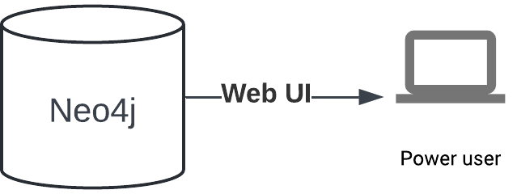

Cartography is a Python tool that consolidates infrastructure assets and the relationships between them in an intuitive graph view powered by a [Neo4j](https://www.neo4j.com) database.

## Why Cartography?
Cartography aims to enable a broad set of exploration and automation scenarios. It is particularly good at exposing otherwise hidden dependency relationships between your service's assets so that you may validate assumptions about security risks.

Service owners can generate asset reports, Red Teamers can discover attack paths, and Blue Teamers can identify areas for security improvement. All can benefit from using the graph for manual exploration through a web frontend interface, or in an automated fashion by calling the APIs.

Cartography is not the only [security](https://github.com/dowjones/hammer) [graph](https://github.com/BloodHoundAD/BloodHound) [tool](https://github.com/Netflix/security_monkey) [out](https://github.com/vysecurity/ANGRYPUPPY) [there](https://github.com/duo-labs/cloudmapper), but it differentiates itself by being fully-featured yet generic and [extensible](https://lyft.github.io/cartography/dev/writing-analysis-jobs.html) enough to help make anyone better understand their risk exposure, regardless of what platforms they use. Rather than being focused on one core scenario or attack vector like the other linked tools, Cartography focuses on flexibility and exploration.

You can learn more about the story behind Cartography in our [presentation at BSidesSF 2019](https://www.youtube.com/watch?v=ZukUmZSKSek).

## Supported platforms

- [Amazon Web Services](https://lyft.github.io/cartography/modules/aws/index.html) - API Gateway, Config, EC2, ECS, ECR, Elasticsearch, Elastic Kubernetes Service (EKS), DynamoDB, IAM, Inspector, KMS, Lambda, RDS, Redshift, Route53, S3, Secrets Manager, Security Hub, SQS, SSM, STS, Tags
- [Google Cloud Platform](https://lyft.github.io/cartography/modules/gcp/index.html) - Cloud Resource Manager, Compute, DNS, Storage, Google Kubernetes Engine
- [Google GSuite](https://lyft.github.io/cartography/modules/gsuite/index.html) - users, groups
- [Duo CRXcavator](https://lyft.github.io/cartography/modules/crxcavator/index.html) - Chrome extensions, GSuite users
- [Oracle Cloud Infrastructure](docs/setup/config/oci.md) - IAM
- [Okta](https://lyft.github.io/cartography/modules/okta/index.html) - users, groups, organizations, roles, applications, factors, trusted origins, reply URIs
- [Github](https://lyft.github.io/cartography/modules/github/index.html) - repos, branches, users, teams
- [DigitalOcean](https://lyft.github.io/cartography/modules/digitalocean/index.html)
- [Microsoft Azure](https://lyft.github.io/cartography/modules/azure/index.html) -  CosmosDB, SQL, Storage, Virtual Machine
- [Kubernetes](https://lyft.github.io/cartography/modules/kubernetes/index.html) - Cluster, Namespace, Service, Pod, Container
- [PagerDuty](https://lyft.github.io/cartography/modules/pagerduty/index.html) - Users, teams, services, schedules, escalation policies, integrations, vendors
- [Crowdstrike Falcon](https://lyft.github.io/cartography/modules/crowdstrike/index.html) - Hosts, Spotlight vulnerabilities, CVEs
- [NIST CVE](https://lyft.github.io/cartography/modules/cve/index.html) - Common Vulnerabilities and Exposures (CVE) data from NIST database
- [Lastpass](https://lyft.github.io/cartography/modules/lastpass/index.html) - users
- [BigFix](https://lyft.github.io/cartography/modules/bigfix/index.html) - Computers
- [Duo](https://lyft.github.io/cartography/modules/duo/index.html) - Users, Groups, Endpoints
- [Kandji](https://lyft.github.io/cartography/modules/kandji/index.html) - Devices
- [SnipeIT](https://lyft.github.io/cartography/modules/snipeit/index.html) - Users, Assets

## Philosophy
Here are some points that can help you decide if adopting Cartography is a good fit for your problem.

### What Cartography is
- A simple Python script that pulls data from multiple providers and writes it to a Neo4j graph database in batches.
- A powerful analysis tool that captures the current snapshot of the environment, building a uniquely useful inventory where you can ask complex questions such as:
  - Which identities have access to which datastores?
  - What are the cross-tenant permission relationships in the environment?
  - What are the network paths in and out of the environment?
  - What are the backup policies for my datastores?
- Battle-tested in production by [many companies](#who-uses-cartography).
- Straightforward to extend with your own custom plugins.
- Provides a useful data-plane that you can build CSPM applications on top of.

### What Cartography is not
- A near-real time capability.
  - Cartography is not designed for very fast updates. Cartography writes to the database in a batches (not streamed).
  - Cartography is also limited by how most upstream sources only provide APIs to retrieve assets in a batched manner.
- By itself, Cartography does not capture data changes over time.
  - Although we do include a [drift detection](docs/root/usage/drift-detect.md) feature.
  - It's also possible to implement other processes in your Cartography installation to make this happen.

## Install and configure

### Trying out Cartography on a test machine
Start [here](https://lyft.github.io/cartography/install.html) to set up a test graph and get data into it.

### Setting up Cartography in production
When you are ready to try it in production, read [here](docs/root/ops.md) for recommendations on getting cartography spun up in your environment.

## Usage

### Querying the database directly

Now that data is in the graph, you can quickly start with our [querying tutorial](https://lyft.github.io/cartography/usage/tutorial.html). Our [data schema](https://lyft.github.io/cartography/usage/schema.html) is a helpful reference when you get stuck.

### Building applications around Cartography
Directly querying Neo4j is already very useful as a sort of "swiss army knife" for security data problems, but you can also build applications and data pipelines around Cartography. View this doc on [applications](docs/root/usage/applications.md).

## Community

- Join us on `#cartography` on the [Lyft OSS Slack](https://join.slack.com/t/lyftoss/shared_invite/enQtOTYzODg5OTQwNDE2LTFiYjgwZWM3NTNhMTFkZjc4Y2IxOTI4NTdiNTdhNjQ4M2Q5NTIzMjVjOWI4NmVlNjRiZmU2YzA5NTc3MmFjYTQ).
- Talk to us and see what we're working on at our [monthly community meeting](https://calendar.google.com/calendar/embed?src=lyft.com_p10o6ceuiieq9sqcn1ef61v1io%40group.calendar.google.com&ctz=America%2FLos_Angeles).
  - Meeting minutes are [here](https://docs.google.com/document/d/1VyRKmB0dpX185I15BmNJZpfAJ_Ooobwz0U1WIhjDxvw).
  - Recorded videos are posted [here](https://www.youtube.com/playlist?list=PLMga2YJvAGzidUWJB_fnG7EHI4wsDDsE1).
- Our current project roadmap is [here](https://github.com/orgs/lyft/projects/26/views/1).

## Contributing
Thank you for considering contributing to Cartography!

### Code of conduct
Legal stuff: This project is governed by [Lyft's code of conduct](https://github.com/lyft/code-of-conduct).
All contributors and participants agree to abide by its terms.

### Bug reports and feature requests and discussions
Submit a GitHub issue to report a bug or request a new feature. If we decide that the issue needs more discussion - usually because the scope is too large or we need to make careful decision - we will convert the issue to a [GitHub Discussion](https://github.com/lyft/cartography/discussions).

### Developing Cartography

Get started with our [developer documentation](https://lyft.github.io/cartography/dev/developer-guide.html). Please feel free to submit your own PRs to update documentation if you've found a better way to explain something.

#### Sign the Contributor License Agreement (CLA)

We require a CLA for code contributions, so before we can accept a pull request
we need to have a signed CLA. Please [visit our CLA service](https://oss.lyft.com/cla)
and follow the instructions to sign the CLA.

## Who uses Cartography?

1. [Lyft](https://www.lyft.com)
1. [Thought Machine](https://thoughtmachine.net/)
1. [MessageBird](https://messagebird.com)
1. [Cloudanix](https://www.cloudanix.com/)
1. [ZeusCloud](https://www.zeuscloud.io/)
1. [Corelight](https://www.corelight.com/)
1. {Your company here} :-)

If your organization uses Cartography, please file a PR and update this list. Say hi on Slack too!
